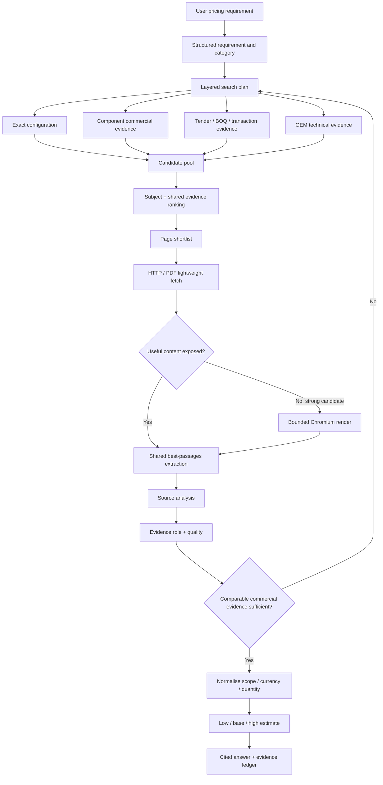

# Research Search and Evidence Lessons

This document records the lessons learned from diagnosing weak/empty Internet Pricing research results after the shared `research-core` migration. It is intended to be a durable reference for future development, regression investigation and expansion into Tender Designer / Should-Cost Intelligence.

The key lesson is that difficult pricing research cannot be treated as **find one page that exactly matches the entire requirement**. The application must search for complementary pieces of evidence, preserve useful commercial values even when they appear in a lower-ranked passage, and only stop once the evidence is commercially and technically usable.

## Reference regression case

The main regression case used during this work was:

```text
11kV AIS 3200A switchboard, 25kA,
2 incomers 2000A,
8 feeders 630A
```

A useful public benchmark for this requirement is unlikely to exist as one exact ten-panel quotation. Good research instead combines evidence such as:

- 11 kV / 630 A / 25 kA feeder-panel tender or BOQ awards;
- 11 kV / 2000 A incomer transaction, quotation or import/export evidence;
- 3200 A busbar/platform technical evidence;
- complete switchboard / switchgear package awards where scope is clear;
- OEM technical data to validate voltage, current, fault level, insulation type and standards.

This case should remain a regression test for future changes to query generation, candidate ranking, page fetching, passage extraction and stopping logic.

## What was going wrong

Several independent behaviours combined to make useful Internet information appear to be ignored.

### 1. Queries were too monolithic

The HV query builder tended to repeat the full equipment description and append phrases such as:

```text
... tender award procurement price
... schedule of rates cost data pdf
... framework contract award lot value
```

That preserves the specification, but it is often too restrictive. A search result containing a highly useful 630 A feeder-panel award may not also mention the 3200 A busbar and 2000 A incomers, so the search engine may never return it.

### 2. Candidate ranking happened before most pages were read

The application has a finite page-reading budget. Search-result title/snippet ranking therefore decides which pages are actually opened.

If a useful commercial source ranks below generic specification or marketing pages, it can be discarded before the page itself is ever inspected. This is especially important for tender, BOQ, invoice and trade-data pages where the most valuable evidence may not be visible in the search snippet.

### 3. Passage selection was relevance-led rather than evidence-led

The initial shared passage selector mainly rewarded lexical overlap with the query. That could select a descriptive paragraph containing many matching technical words while dropping another paragraph containing the actual award value or transaction price.

For pricing research, commercial evidence must not disappear simply because another passage has slightly better word overlap.

### 4. Chromium rendering was disabled for HV pages

The browser fallback originally excluded `hv-equipment` and `service-project` categories. This meant a JavaScript-heavy tender or transaction page could be selected, fail to expose useful information through the lightweight fetch, and then never receive the browser-rendering fallback available to other product categories.

### 5. Any currency value could end specialist research too early

A large project value is not automatically an equipment price. A substation award may include transformers, DG sets, LV boards, cables, civils, erection and commissioning as well as the requested switchgear.

Stopping research after seeing any currency amount can therefore turn an unrelated project total into a false equipment benchmark.

## Current design principles

### Search for evidence layers, not one perfect page

Complex HV requests are now decomposed into complementary searches. For the regression case, the intended pattern is approximately:

```text
<complete board description> tender award procurement price
"11kV" "2000A" "25kA" incomer switchboard import export customs price
"11kV" "630A" "25kA" feeder VCB panel tender award unit price
"11kV" "3200A" busbar AIS switchboard technical data
TenderKart 11kV 25kA VCB panel award price
Volza 11kV 2000A 25kA switchboard transaction
```

The exact generated strings may evolve, but the **layered intent must remain**:

1. exact/full-configuration search;
2. feeder commercial evidence;
3. incomer commercial evidence;
4. busbar/platform technical evidence;
5. tender/award/BOQ evidence;
6. transaction/import/export evidence;
7. OEM technical validation.

Planner-generated searches should also be retained when they explore a useful complementary evidence role. They should not be forced to repeat every original rating.

## Evidence is the unit of knowledge

A web page is only a container. The useful unit is an evidence record.

Retained evidence is classified into roles:

- `PRICE_EVIDENCE` — award values, unit rates, transaction values, quotations, invoices, BOQ values, commercial offers, etc.;
- `SPEC_EVIDENCE` — electrical ratings, IEC/IEEE standards, configuration, AIS/GIS type, busbar rating and other technical comparability data;
- `SUPPLIER_EVIDENCE` — manufacturer, distributor, framework or supplier context without a strong direct price/spec claim;
- `BACKGROUND_EVIDENCE` — useful context that should not drive the headline benchmark by itself.

A single source may fulfil more than one role. It is valid, and often preferable, for separate sources to establish commercial price and technical comparability.

## Shared `research-core` responsibilities

Generic research mechanics belong in `research-core` so every consumer benefits.

As of `research-core` v0.2.1 the shared package provides:

- numeric/specification-aware passage selection;
- commercial-evidence preservation for prices, awards, BOQs, quotations, invoices and transaction data;
- evidence-aware candidate scoring via `evidence_rank_score()`;
- generic evidence signals for tenders, contracts, awards, frameworks, schedules of rates, purchase orders, BOQs, quotations, commercial offers, invoices, customs, import/export and transactions;
- PDF/evidence bonuses and weak-source penalties;
- ranking based primarily on returned title/snippet/URL rather than treating the originating search query itself as evidence;
- domain diversity so one host cannot consume the entire shortlist.

Applications should not reimplement these generic mechanics unless a domain-specific rule genuinely cannot live in the shared core.

## Internet Pricing responsibilities

Pricing-specific policy remains in Internet Pricing, including:

- category classification (`consumer-retail`, `industrial`, `hv-equipment`, `service-project`, `general-product`);
- HV query decomposition;
- voltage/current/fault-level comparability rules;
- equipment-vs-project scope checks;
- specialist stopping criteria;
- browser-rendering policy for high-value commercial pages;
- pricing answer / estimate behaviour.

The boundary is important: **generic evidence quality belongs in the shared core; pricing interpretation belongs in this application.**

## Candidate ranking before page fetch

Because only a subset of search results can be opened, ranking must favour evidence-bearing candidates before the page budget is spent.

For specialist pricing searches, strong signals include:

- visible currency/value in the title or snippet;
- tender / award / procurement terminology;
- BOQ / bill of quantities;
- quotation / commercial offer;
- invoice / purchase order;
- customs / import / export / transaction;
- PDF or downloadable procurement documents;
- meaningful overlap with requested voltage/current/fault ratings.

Generic SEO pages, reviews and broad category pages should not outrank a commercially meaningful result merely because they repeat more query words.

`research-core` now provides the generic evidence score; Internet Pricing combines it with its own equipment/rating relevance score before the shortlist is cut.

## Page fetching and Chromium fallback

The preferred fetch path remains:

```text
Search result
    -> lightweight HTTP/PDF fetch
    -> structured extraction / visible text
    -> bounded Chromium fallback when justified
```

Browser rendering is expensive and should remain bounded, but specialist HV pages are no longer categorically excluded.

A promising HV candidate can use Chromium when:

- it is a public HTTP/HTTPS page;
- it is not already a PDF or rendered page;
- lightweight content does not expose a price/value;
- the page is strongly associated with tender/award/BOQ/quotation/import-export/transaction evidence;
- it is highly ranked within the current candidate batch.

Known useful evidence-source patterns encountered during development included TenderKart, Volza and Zauba. These are useful examples, not a reason to hard-code the entire research strategy around three websites. The underlying evidence signals must continue to work for new sources.

The browser fallback must not attempt to bypass authentication, CAPTCHAs, bot protection or other access controls.

## Passage selection rules

For commercial research, a price-bearing passage should survive passage selection when it is relevant enough to the requested subject, even when another passage has slightly higher lexical similarity.

Useful passage signals include:

- currencies and explicit amounts;
- `unit price`, `unit rate`, `award value`, `winning bid`, `contract value`;
- `schedule of rates`, `bill of quantities`, `BOQ`;
- `purchase order`, `commercial offer`, `quotation`, `invoice`;
- `customs`, `import`, `export`, `transaction value`;
- technical numeric signals such as kV, kA, A, MVA, kVA, MW and kW.

This behaviour is shared in `research-core` rather than being limited to Internet Pricing.

## Specialist stopping rules

For HV / industrial / service research, **finding any price is not enough**.

Research should continue unless there is usable commercial evidence with sufficient subject/specification context.

For HV equipment, a strong early-stop benchmark should normally satisfy most of the following:

- clear switchgear/switchboard/panel/disconnector subject match;
- appropriate voltage class;
- at least two useful matching technical ratings where available;
- line-item, unit, BOQ, award, quotation, shipment or transaction context;
- not merely a complete project total containing several unrelated scopes.

A source that includes transformers, DG sets, LV boards, cables and civils together with one large project value must not be treated as the requested switchboard price unless the switchgear value is separately identifiable.

## Source patterns that proved useful

During the comparison with ChatGPT-style research, the most productive evidence patterns were:

### Tender / procurement sources

Useful for:

- panel quantities;
- award values;
- BOQ line items;
- framework and contract values;
- exact voltage/current/fault-level descriptions.

Example source pattern: TenderKart and public procurement portals.

### Trade / transaction databases

Useful for:

- individual equipment transaction values;
- import/export shipment descriptions;
- manufacturer/model/ratings where available;
- high-current incomer or switchgear comparators.

Example source patterns: Volza and Zauba.

### OEM technical sources

Useful for:

- validating ratings and standards;
- checking whether a commercial comparator belongs to the same equipment class;
- confirming AIS/GIS platform capability;
- understanding current/fault-level ranges.

Examples encountered during research included ABB and Schneider technical material.

OEM pages frequently provide **specification evidence rather than price evidence**. That is still valuable and should not be rejected simply because a price is absent.

## Evidence quality versus evidence role

Do not confuse these two concepts.

**Role** describes what the source contributes:

```text
PRICE / SPEC / SUPPLIER / BACKGROUND
```

**Quality** describes how trustworthy/useful that contribution is:

```text
STRONG / USEFUL / WEAK / REJECT
```

A strong OEM datasheet may be `STRONG + SPEC_EVIDENCE` with no price. A tender result may be `STRONG + PRICE_EVIDENCE + SPEC_EVIDENCE`. A market article may be `WEAK + BACKGROUND_EVIDENCE`.

Both dimensions should eventually be visible in debugging/telemetry.

## Rejection diagnostics

Future work should favour structured rejection reasons instead of only `failed` / `not useful` messages.

Recommended reason codes include:

```text
NO_PRICE
NO_READABLE_CONTENT
WRONG_PRODUCT
WRONG_VOLTAGE_CLASS
INSUFFICIENT_RATING_MATCH
PROJECT_TOTAL_NOT_EQUIPMENT_PRICE
GENERIC_CATEGORY_PAGE
DUPLICATE_SOURCE
PAYWALL_OR_LOGIN
BOT_OR_CAPTCHA_BLOCKED
FETCH_FAILED
PDF_PARSE_FAILED
```

These codes will make it much easier to distinguish:

- poor search queries;
- poor ranking;
- a fetch/render problem;
- an extraction problem;
- genuinely irrelevant evidence.

This is an important next diagnostic enhancement.

## Search telemetry that should be retained

A useful research activity log should make it possible to reconstruct why the final answer was produced. At minimum retain:

- generated search query;
- search backend;
- candidate URL/domain;
- original result rank;
- application relevance score;
- shared evidence score;
- whether the page was actually fetched;
- fetch method: cache / HTTP / PDF / Chromium;
- extraction result / content length;
- evidence role;
- source quality/verdict;
- rejection reason if not retained;
- whether the source contributed to the final estimate.

The long-term goal is to be able to answer: **Which searches produced useful evidence, which sites failed, why were they rejected, and which values actually influenced the estimate?**

## Expected research flow



## Regression expectations

When running the reference switchboard case, a healthy application should show several distinct search intents rather than six cosmetic variations of the full specification.

Expected signs of healthy behaviour:

- feeder and incomer searches are visibly separate;
- tender/BOQ/transaction terms appear in generated queries;
- a useful 630 A panel result can reach page fetching even if it lacks 3200 A / 2000 A references;
- OEM specification pages may be retained as `SPEC_EVIDENCE` without a price;
- a whole-substation project total does not end the research;
- price/award passages remain in the evidence ledger;
- Chromium may be attempted on a highly ranked HV commercial page whose light HTML is incomplete;
- research continues until commercially usable evidence exists or configured depth limits are reached.

## Deployment / versioning lesson

`Internet_pricing` pins `research-core` to a known Git commit in `requirements.txt`.

When the shared core changes, deployment must do more than restart the application. Run:

```bash
git pull
python -m pip install -r requirements.txt
```

Otherwise the Python environment may continue using the previously installed research-core version even though the Internet Pricing repository has been updated.

When introducing a material shared-core behaviour change:

1. update and test `research-core` first;
2. bump its version;
3. keep CI green;
4. pin the consuming application to the tested core commit;
5. add/adjust regression tests in the consuming application;
6. reinstall requirements on deployment.

## Shared-core versus application-specific change checklist

Before adding new research logic, decide where it belongs.

Put it in **research-core** when it is generally useful to research applications, for example:

- evidence-aware ranking;
- commercial-value passage preservation;
- technical/numeric matching primitives;
- generic domain diversity;
- research-depth mechanics;
- evidence ledger structures.

Keep it in **Internet Pricing** when it is specifically about pricing interpretation, for example:

- HV component decomposition;
- recognising incomer / feeder / busbar roles;
- project-total rejection;
- price sufficiency rules;
- pricing category strategy;
- low/base/high estimate synthesis.

This separation prevents one application from fixing a generic problem privately while the other consumers continue to suffer from it.

## Future improvements

Priority enhancements after this work:

1. structured rejection reason codes and visible diagnostics;
2. store candidate ranking components in the research activity log;
3. show which evidence records materially influenced the final estimate;
4. structured extraction of quantity, unit-price scope and total-price scope;
5. structured electrical-rating comparison rather than relying primarily on token matching;
6. automatically search adjacent standard voltage classes where appropriate (for example 11/12 kV or 132/145 kV) while clearly recording the mismatch;
7. learn high-performing query patterns from successful past searches without overfitting to individual domains;
8. feed generic improvements back to `research-core` so Tender Designer and Should-Cost Intelligence benefit too.

## Development rule of thumb

When pricing research looks empty, do not immediately conclude that the internet has no data.

Inspect the pipeline in this order:

```text
Did we generate the right evidence-layer queries?
        -> Did the search engines return promising candidates?
        -> Did ranking allow them into the page-read shortlist?
        -> Did HTTP/PDF/Chromium retrieve the real content?
        -> Did passage selection preserve the price/spec evidence?
        -> Did source analysis classify it correctly?
        -> Did the stopping rule continue searching when evidence was incomplete?
        -> Did the synthesis actually use the retained evidence?
```

That sequence captures the central lesson from this regression: **a page can appear to have been ignored at several different stages, and each stage requires a different fix.**
